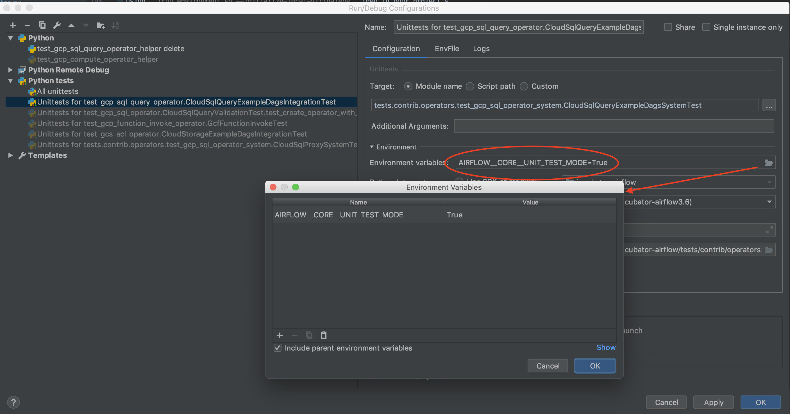

# Unit tests in Airflow Breeze

There are many automated test cases in Airflow. They are standard unittests
from python and most of the interesting ones for us are in
`/workspace/test/contrib/*` directories. Standard python unit tests are used.

## Running Unit tests within the container environment

If you are working within the container, you may use the following commands to
run tests.

`./run_unit_tests.sh tests.core:CoreTest -s --logging-level=DEBUG`
`./run_unit_tests.sh tests.contrib.operators.test_dataproc_operator -s
--logging-level=DEBUG`

## Running Unit tests within the IDE (IntelliJ)

Running the tests from IDE requires to have a local virtualenv setup. You can do it
using `./run_environment.sh --initialize-local-virtualenv`. Then in your project's
configuration you should select the virtualenv you initialized as the project's default
virtualenv.

After setting up the environment, you can use the usual "Run Test" option of the IDE.

Note that some unit tests in core airflow (not GCP tests!) will not work this way 
as they are not  true "Unit" tests - they require some external services. 
Also some of the core tests use dags defined in `tests/dags` folder - 
those tests should have `AIRFLOW__CORE__UNIT_TEST_MODE` set to 
`True`. You can always set it up in your test configuration

System tests (which are run as Python tests) cannot have the 
`AIRFLOW__CORE__UNIT_TEST_MODE` variable set and they will fail if it is set.
You can read more about system tests in [README.systemtests.md](README.systemtests.md)

## Unit Tests in Travis CI (Continuous Integration)

In order to run the tests, ensure you have set up TravisCI on your fork of the Airflow
GitHub repo. This is described in
[Travis CI setup instructions](https://github.com/apache/incubator-airflow/blob/master/CONTRIBUTING.md#testing-on-travis-ci)

This will make all unit tests to be executed automatically for all your
branches/PR pushes.

System Tests described in [README.systemtests.md](README.systemtests.md) are skipped 
by default during Travis CI run.
