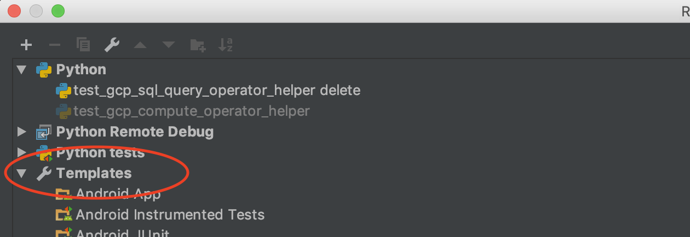
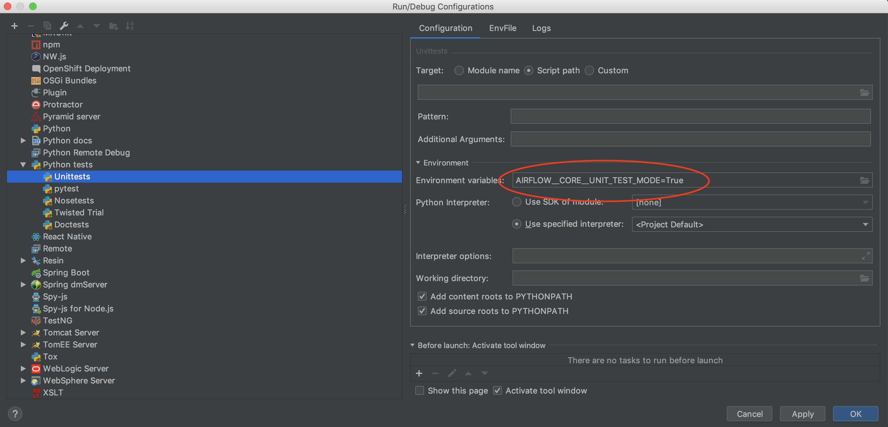

# Unit tests in Airflow Breeze

There are many automated test cases in Airflow. They are standard unittests
from python and most of the interesting ones for us are in
`/workspace/test/contrib/*` directories. Standard python unit tests are used.

## Running Unit tests within the container environment

If you are working within the container, you may use the following commands to
run tests.

`./run_unit_tests.sh tests.core:CoreTest -s --logging-level=DEBUG`
`./run_unit_tests.sh tests.contrib.operators.test_dataproc_operator -s
--logging-level=DEBUG`

## Running Unit tests within the IDE (IntelliJ)

Running the tests from IDE requires to have a local virtualenv setup. You can do it
using `./run_environment.sh --initialize-local-virtualenv`. Then in your project's
configuration you should select the virtualenv you initialized as the project's default
virtualenv.

After doing so, you can use the usual "Run Test" option of the IDE.

Note that some unit tests (and System Tests) require `AIRFLOW__CORE__UNIT_TEST_MODE`
environment variable set to `'True'`. If you do not set the variable, the tests will
warn you to do so.

You can set the variable in "Run Configuration" of particular test you want to run:

However it's recommended that you set it in the Template/Python/Unittests, this way
all new tests will have the variable automatically set.

## Running Unit Tests in Travis CI (Continuous Integration)

In order to run the tests, ensure you have set up TravisCI on your fork of the Airflow
GitHub repo. This is described in
https://github.com/apache/incubator-airflow/blob/master/CONTRIBUTING.md#testing-on-travis-ci

This will make all unit tests to be executed automatically for all your
branches/PR pushes (note that System Tests described below are automatically skipped
during Travis CI run)
